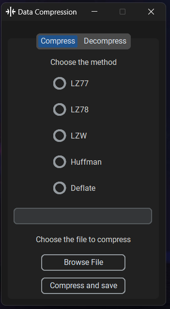

# Data-Compression

A program for compressing files using such algorithms as **LZW**, **Huffman code**, **LZ77** and **LZ78**, **Deflate**.

## Contents

- [Installation](#installation)
- [Interface](#interface)
- [Description of algorithms](#description-of-algorithms)
  - [LZW](#lzw)
  - [LZ78](#lz78)
  - [Huffman](#huffman)
  - [LZ77](#lz77)
- [Collaborators](#collaborators)

## Installation

Requirements: Python 3.11

```
git clone https://github.com/TepliakovZakhariy/Data-Compression
cd Data-Compression
pip install -r requirements.txt
python src/main.py
```

## Interface

To develop the GUI, we chose the **CustomTkinter** library. Regular Tkinter is the Python interface to the Tk GUI toolkit and is the de facto standard Python GUI. The advantage of CustomTkinter over Tkinter is its ease of use and new built-in widgets that can be widely customized.

The program has two tabs: **Compress** and **Decompress**.

To compress a file, you need to select one of the encoding algorithms presented. By clicking the "Browse File" button, select the file you want to encode. Then click the "Compress and Save" button, set the name and location for the encoded file and wait for the window that will inform you about the completion of compression.

To return the compressed file to its original form, go to the "Decompress" tab, click the "Browse File" button, select the desired file and click the "Decompress and Save" button, set the name and location for the decompressed file and wait for the window to notify you that decompression is complete.

## Description of algorithms

### LZW

**Lempel-Ziv-Welch (LZW)** algorithm is a general-purpose lossless data compression algorithm created by Abraham Lempel, Jacob Ziv and Terry Welch. It was published by Welch as an improved implementation of the LZ78 algorithm published by Lempel and Ziv.

A notable feature of the LZW algorithm is its simplicity of implementation. The main advantage of the algorithm is that its initial dictionary for encoding and decoding is always the same, so we don't need to put it in the compressed file itself, which significantly reduces the file weight.

#### Implementation

- **encode()**

  The **encode** method takes a byte string as input, and then checks whether it is empty - otherwise, it returns an empty string and a single byte. If the string is not empty, then an initial algorithm is created that contains all single-byte characters and their sequence number from 0 to 255. This is the main advantage of the algorithm - we don't need to pass the dictionary to the decoding function because the same dictionary is created there at the beginning.

  After that, an empty byte list encoded_text and an empty byte string temp are created. Then, according to the LZW algorithm, the algorithm searches through each character of the text and adds it to temp. If temp is not in the dictionary, then the code corresponding to temp without the last character is added to the encoded text, the key equal to temp in its binary representation is added to the dictionary, and temp is changed only to the last character of the byte string temp. How does it work? It would be illogical to encode each number as a sequence of digits in the form of a string, so instead we will encode numbers as numbers. At the beginning, the algorithm tries to encode each number with 3 bits, which allows us to encode numbers from 0 to 2^(8\*3)-1 = 2^24-1. If the input file is too large and the numbers we want to encode are larger than this upper limit, the algorithm will use more bytes than 3: 4, 5, 6... After the algorithm has gone through all the characters of the text, temp is added to encoded_text, and the algorithm returns the encoded text and the number of bytes each number is encoded with.

- **decode()**

  The **decode** function takes encoded byte text and the number of bytes that encode each number. At the beginning, the function checks whether the input text is an empty string, otherwise the function returns an empty string as well. After that, it creates an identical dictionary to the one in the encoding function, which contains all the one-byte characters numbered from 0 to 255. The method starts by iterating through the encoded byte sequence. It reads the encoded bytes in the chunks specified by the bytes_per_code parameter, interpreting them as integer values. These integers represent the codes generated during the encoding process.

  For each code, the algorithm checks whether it is in the dictionary. If not, the algorithm adds the value of the previous entry with its first byte to the dictionary. When processing each code, the corresponding sequence from the dictionary is added to decoded_text. The function returns a sequence of bytes that can be written to the output file, resulting in a decoded file.

- **encode_files()**

  The **encode_files** function takes a file path and a name to name the encoded file.

  First, the function reads the bytes of the input file and encodes them using the encode() function. After that, the function places the extension of the original file, the number of bytes that encode each number, and the encoded text of the file into the encoded file. These values are separated by the "|" character.

- **decode_files()**

  The **decode_files** function takes the path to the encoded file and the name to be given to the decoded file

  At the beginning, the function reads the bytes of the input file and divides them into three elements with the "|" character - the file extension, the number of bytes that encode each number, and the encoded text of the file.

  After that, the text is decoded with the decode() function, and the resulting bytes are written to the output file.

- **get_extension()**

  This function accepts an encoded file and returns its original extension, which is required for the program itself.

#### Efficiency

| File extension | Initial file weight | Compressed file weight | Compression time | Decompression time |
| -------------- | ------------------- | ---------------------- | ---------------- | ------------------ |
| ipynb          | 179 KB              | 216 KB                 | 1s               | 0.5s               |
| png            | 428 KB              | 722 KB                 | 1s               | 0.5s               |
| txt            | 2.8 MB              | 1.2 MB                 | 1.7s             | 0.7s               |
| XML            | 97.6 MB             | 35.6 MB                | 56s              | 16s                |

#### Conclusion

The LZW algorithm is fast enough and is a great option when you need to compress a text file, as it can compress up to 70% of the size. For other extensions, the algorithm performs worse and can make the compressed file larger than the original.

### LZ78

**LZ78** is one of the data compression algorithms invented by Abraham Lempel and Jakob Ziv, which is where the abbreviation actually comes from. The algorithm is based on the principle of passing two elements to the output: an index and an element. Our output itself looks like a conditional list with a very large number of tuples containing the two elements already mentioned. Elements are passed according to the principle: if an element or a sequence of elements has not been encountered before, we write it to our list, and give the index of the largest sequence that has already been encountered and the last element in the output.

- **encode()**

  First, according to the already defined algorithm, we binary read the file and pass all this information to the main function. Inside the algorithm, we are already working with bytes. For each index, we allocate from one byte (at first we encode the file with 1 byte, if not, then two, and so on) , when we encode a character with one byte. Thus, we encode one sequence from 2 bytes onwards. Usually, three bytes is the most optimal weight for encoding an index, because 4 is too much and 2 is too little (1 byte can encode numbers from 0 to 255, i.e. 2^8, 2 bytes up to 2^16, etc.)

  Then we write it all binary to a file, which we provide to the user via the path he or she has defined (the path itself is specified in our Tkinter). Additionally, we write down how many bytes one index was encoded with (this will be our first written byte). We also need to define the format of our file. To do this, we first split the name of our path with one dot (i.e. maxsplit = 1), then write it to the file byte by byte. The first byte is the length of the extension, and the next three bytes are the extension itself.

- **decode()**

  To decode a binary file, we open the file and read the number of bytes that were written + 1: the allocated number of bytes is the index, and 1 byte is the character. We decompose all these elements into readable ones and process them. After all these machinations, we simply write all our formations to the file in binary. We encode them in binary because this is the only way to work with all possible data (from text files to videos and mp3 files).

- **get_extension()**

  The function **get_extension** reads the file format we have encoded to correctly decode the file in the desired format.

#### Efficiency

| File extension | Initial file weight | Compressed file weight | Compression time | Decompression time |
| -------------- | ------------------- | ---------------------- | ---------------- | ------------------ |
| ipynb          | 179 KB              | 154 KB                 | 0.5s             | 0.3s               |
| png            | 428 KB              | 640 KB                 | 0.5s             | 0.5s               |
| txt            | 2.8 MB              | 1.4 MB                 | 1.8s             | 1s                 |
| XML            | 97.6 MB             | 42.6 MB                | 57s              | 20s                |

#### Conclusion

LZ78 is very effective with text files and files with many repetitive sequences. It works worse with already good compressed files (like .png or .jpg).

### Huffman

**Huffman** algorithm is a general-purpose lossless data compression algorithm created by David A. Huffman in 1952. While studying at MIT he had a choice: to write final exam or term paper on the problem of finding the most efficient binary code. Only when the time for writing exam got closer he came up with this solution.

Inspite of being made by the student this algorithm is Shannon–Fano coding which was the best at that time. The main idea of Huffman algorith is to make a binary tree sorted by frequency and start building codes from the bottom of the tree which provides the shortest code for the most frequent characters and longer code for the least frequent characters. This is obiously effective because most of the time we are using less space for storing data.

While implementing this algorithm we decided to try block coding. It isn't regular block coding because we do not go through all possible blocks in an input.

#### Implementation

- **encode()**

  The **encode** method takes a string as input.
  We are using sliding window with size of block size. For example, if the block size is 1 we just iterate over every charecter. if the block size is 2 and the input is abcde, we iterate over ab, cd and e. while iterating over blocks we count their frequency by creating dictionary beforehand and adding one to their key in that dictionary when we encounter them in input.

  In second step we take frequency dictionary and convert it to sorted list by frequency, which afterwards is converted to double linked list, because inserting in a list is too slow.

  Here we calculate codes for every block. For that we take two least frequent add their frequency and add 1 to the beginning of code of the first one and 0 to the beginning of the second one. we merge them into one but the codes remain separate. Then we find the place where block with such frequency could be placed to keep our linked list sorted. For optimisation we rememeber the place where we last time inserted the merged block, which helps us to reduce time for insertion.

  We finally have codes, so we just iterate over blocks of input and
  replace them with created codes, while iterating we convert encoded text to bytes

- **decode()**

  The **decode** function takes encoded bytes and dictionary for encoding and decoding.
  Firstly, we convert bytes to string of bits. After that we just take that string of bits and convert it using the dictionary.

- **encode_files()**

  The **encode_files** function takes a file path and a name to name the encoded file.

  Firstly, the function reads the bytes of the input file and encodes them using the encode() function.

  After that, the function places number of keys, block size, the smallest block size and file extension at the beginning of the encoded file. They are separated by "/" and end with "|". After that we write to the file coding dictionary sorted by length of block in descending order and converted to string, ";" for separation and encoded bytes.

- **decode_files()**

  The **decode_files** function takes the path to the encoded file and the name to be given to the decoded file

  The function reads the file from path and takes first chunk of information that ends with "|". this chunk includes such values: amount of keys, block size, the smallest block size and extension.

  After that function reads the dictionary which is possible because we have all needed information from first chunk of information. We use amount of blocks to know where to look for the smalles block. and smalles block size to know how many symbols is in that block.

  Then we decode the file by giving the rest of the file and coding dict to **decode()** function and write decoded_text to new path.

- **get_extension()**

  This function accepts an encoded file and returns its original extension, which is required for the program itself.

#### Efficiency

| File extension | Initial file weight | Compressed file weight | Compression time | Decompression time |
| -------------- | ------------------- | ---------------------- | ---------------- | ------------------ |
| ipynb          | 179 KB              | 143 KB                 | 0.3s             | 0.7s               |
| png            | 428 KB              | 431 KB                 | 0.6s             | 0.8s               |
| txt            | 2.8 MB              | 1.7 MB                 | 1.8s             | 2.1s               |
| XML            | 97.6 MB             | 62.3 MB                | 48s              | 3m                 |

#### Conclusion

The Huffman algorithm works well if the file contains characters that occur more often than others. It is also better if there are not too many different characters.

### LZ77

The **LZ77** algorithm is a lossless data compression algorithm created by Abraham Lempel and Jacob Ziv in 1977. The main idea of this algorithm is to get rid of all repetitions. It does this very well, but it takes too much time.

#### Implementation

- **encode()**

  The **encode** method takes a string as input.
  We iterate over the input, find the largest character in the buffer and store the first index, the length of the match, the character that does not match, then convert and add it to the encoded bytes.
  The function returns encoded bytes.

- **decode()**

  The **decode** function takes encoded text.
  After that, it converts the text to list of tuple and decodes in this way.
  For example if we have tuple 0, 0, a. We have to add "a" to encoded text. If the tuple is 1, 2, b. we start from symbol in index - 1 move 2 times to the right and copy those two charecters to coded text.

- **encode_files()**

  The **encode_files** function receives the file path and name for the encoded file.
  First, the function reads the bytes of the input file and encodes them using the encode() function.
  After that, the function puts the extension, "|" and encoded_bytes.

- **decode_files()**

  The **decode_files** function takes the path to the encoded file and the name that will be given to the decoded file.
  We read bytes from the encoded file, convert them to a string, and pass them to the encode function.
  Then we write the decoded text from this function to the new path.

- **text2list**
  This function converts text to list by iterating over text and saving iterated part to list when it sees charecter after second comma.

- **get_extension()**

  This function takes an encoded file and returns its original extension, which is necessary for the program itself.

#### Efficiency

| File extension | Initial file weight | Compressed file weight | Compression time | Decompression time |
| -------------- | ------------------- | ---------------------- | ---------------- | ------------------ |
| ipynb          | 179 KB              | 483 KB                 | 1.2s             | 0.5s               |
| png            | 428 KB              | 1.6 MB                 | 3s               | 1s                 |
| txt            | 2.8 MB              | 6.2 MB                 | 11s              | 2s                 |

#### Conclusion

The LZ77 algorithm is very good if there are many repeating sequences. Otherwise, it needs a very large buffer size.

## Collaborators

- Teplyakov Zakhary - LZW
- Lev-Fedor Lysyk - LZ77, Huffman
- Vladislav Sidorak - Interface
- Oleg Shtogrin - LZ78
